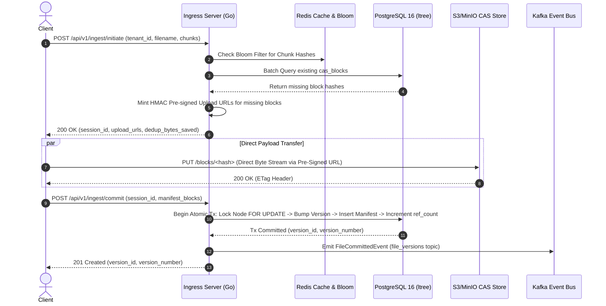

# Project Aegis: Master Architectural Validation & Design Blueprint

## 1. Executive Architecture Summary

Project Aegis is an exabyte-capable, multi-tenant distributed file storage and synchronization engine. The core design principle is **physical decoupling of the data plane from the control plane**.

High-throughput binary chunk I/O streams directly to object storage (S3/MinIO), while metadata state operations, authentication, deduplication pre-filtering, and version commits execute statelessly in Go against PostgreSQL and Redis.

---

## 2. Invariant Specifications

### Invariant I-1: Bit-Perfect Content-Addressed Storage (CAS)
- Every data payload is chopped into content-defined chunks using **FastCDC**.
- Each chunk is identified strictly by its 32-byte SHA-256 digest: $\text{BlockID} = \text{SHA-256}(\text{ChunkBytes})$.
- Object storage keys follow the format: `blocks/<sha256_hex>`.
- Chunks are immutable and append-only. Cross-tenant deduplication occurs at the chunk level.

### Invariant I-2: Acyclic Namespace Path Graph (`ltree`)
- Filesystem hierarchy is represented using PostgreSQL's `ltree` extension.
- Every directory node maintains a materialized `lineage_path` (e.g., `root_uuid.parent_uuid.node_uuid`).
- Cyclic path dependencies are structurally impossible at the database schema level.

### Invariant I-3: Cryptographic Edge Ingress & Zero-Trust Access
- Clients never upload file bytes through API web servers.
- The control plane generates short-lived, tenant-scoped **HMAC pre-signed URLs** (`aegis_hmac_...`).
- Pre-signed URLs are evaluated at edge PoPs using single-use Redis replay nonces (`SETNX`) with a 15-minute TTL.

---

## 3. Detailed Data Plane & Ingestion Flow

---

## 4. Subsystem Catalog & Layer Separation

1. **Ingress Engine (`cmd/ingest`, `internal/ingress`)**: Stateless Go web server handling API routing, token validation, rate limiting, and session management.
2. **FastCDC Chunker (`crates/fastcdc`)**: Rust SIMD-accelerated gear hashing module splitting byte streams into 64KB–1MB chunk boundaries.
3. **Metadata Store (`internal/database`, `db/`)**: PostgreSQL 16 relational store utilizing `ltree` for directory trees and hash partitioning for `cas_blocks`.
4. **Distributed Cache & Locking (`internal/lock`, Redis)**: Redis cluster providing Bloom filter deduplication, token replay nonces, and Redlock distributed locks.
5. **Garbage Collector (`internal/gc`)**: Generational mark-and-sweep GC identifying unreferenced blocks (`ref_count = 0`) and enforcing a 7-day quarantine window before tombstone deletion.
6. **CDC Derivation Bus (`internal/cdc`, `cmd/cdc-router`)**: Debezium WAL router broadcasting `file_version` commits to async worker fleets (ClamAV, OCR, FFmpeg, Vector AI).
7. **B2B Enterprise SaaS (`internal/billing`)**: Multi-meter usage engine, SHA-256 developer API keys, offline enterprise license verification, and Stripe webhooks.
