# Aegis File System — Architecture Diagrams

> **Generated:** August 2026
> **Source:** Derived from actual repository code. No invented components.

---

## Table of Contents

1. [System Context Diagram](#1-system-context-diagram)
2. [Container Diagram](#2-container-diagram)
3. [Component Diagrams](#3-component-diagrams)
4. [Dependency Diagram](#4-dependency-diagram)
5. [Request Lifecycle](#5-request-lifecycle)
6. [Data Flow Diagram](#6-data-flow-diagram)
7. [Authentication Flow](#7-authentication-flow)
8. [Database ER Diagram](#8-database-er-diagram)
9. [Sequence Diagrams](#9-sequence-diagrams)
10. [Deployment Architecture](#10-deployment-architecture)

---

## 1. System Context Diagram

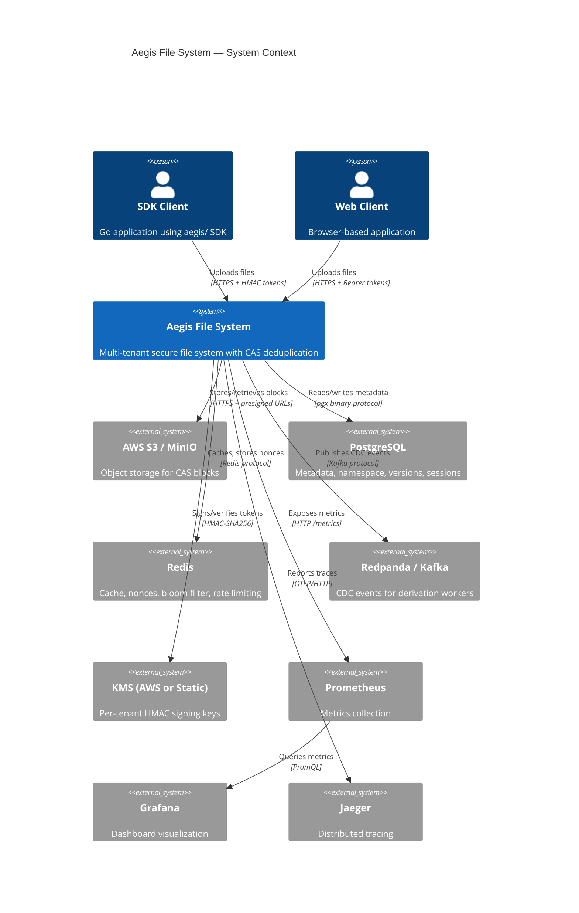

### How to read this diagram

This is a **C4 System Context** diagram. It shows Aegis as a black box in the center, with all external actors (people and systems) that interact with it. Arrows show the direction of communication and the protocol used.

### Important observations

- **Two client types:** SDK (Go) and Web (browser). The SDK uses HMAC pre-signed URLs; web clients use Bearer tokens.
- **Five backing services:** PostgreSQL, Redis, S3, Kafka, KMS. All are required for production operation.
- **Three observability systems:** Prometheus, Grafana, Jaeger. These are for operators, not end users.
- **No CDN:** Clients upload directly to S3 via pre-signed URLs. The server never proxies file bytes.

### Questions I should ask myself

1. What happens if S3 is unavailable during an upload?
2. How does the web client authenticate differently from the SDK client?
3. What is the minimum set of external systems needed for development?
4. How does KMS key rotation affect in-flight pre-signed URLs?
5. What happens if Redis is unavailable? Which features degrade?
6. How does the system handle a PostgreSQL primary failure?
7. What is the data path for a file from client to permanent storage?
8. How does the system ensure cross-tenant isolation at every layer?
9. What observability data is lost if Prometheus is unavailable?
10. How does the system handle Kafka/Redpanda unavailability?

---

## 2. Container Diagram

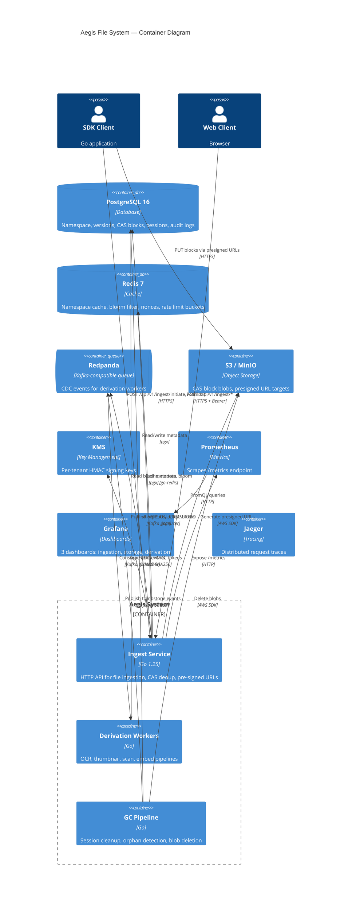

### How to read this diagram

This is a **C4 Container** diagram. It zooms one level deeper than the System Context, showing the internal containers (processes/services) within Aegis and how they communicate with each other and external systems.

### Important observations

- **Three internal processes:** Ingest Service (main), Derivation Workers (optional), GC Pipeline (background).
- **Client uploads to two destinations:** Server for initiate/commit, S3 directly for block data.
- **Event-driven derivation:** Workers consume from Redpanda, not from the server directly.
- **GC is a background process:** It runs inside the same binary as the ingest service (not a separate container in the current architecture).
- **No inter-service HTTP:** All internal communication is via database, Redis, or message queue.

### Questions I should ask myself

1. Why does the client upload blocks directly to S3 instead of through the server?
2. What is the benefit of having derivation workers consume from Kafka instead of being called synchronously?
3. How does the GC pipeline avoid affecting foreground request latency?
4. What happens if the derivation worker pool is saturated?
5. How does the system ensure that tombstone events are processed exactly once?
6. What is the blast radius if Redis goes down?
7. How does the ingest service handle a spike in concurrent initiates?
8. What is the recovery path when PostgreSQL primary fails over to a replica?
9. How does the system handle a slow S3 endpoint during presigned URL generation?
10. What metrics would indicate that the derivation pipeline is falling behind?

---

## 3. Component Diagrams

### 3.1 Ingress Server Components

```mermaid
C4Component
    title Ingress Server — Internal Components

    Container_Ext(client, "SDK/Web Client")
    Container_Ext(postgres, "PostgreSQL")
    Container_Ext(redis, "Redis")
    Container_Ext(s3, "S3 / MinIO")
    Container_Ext(kms, "KMS")

    Component_Boundary(ingress, "Ingress Server") {
        Component(server, "IngressServer", "server.go", "HTTP routing, middleware chain, health endpoints")
        Component(initiate, "handleInitiate", "initiate.go", "Quota check, CAS dedup, presigned URLs, session creation")
        Component(commit, "handleCommit", "commit.go", "Session validation, atomic commit, event publication")
        Component(store, "PgStore", "store.go", "Database operations adapter (12 methods)")
        Component(metrics, "IngestMetrics", "metrics.go", "Prometheus counters/histograms for ingestion")
        Component(ratelimit, "RateLimiter", "ratelimit.go", "Per-tenant token bucket rate limiting")
        Component(cors, "CORSMiddleware", "cors.go", "Configurable cross-origin resource sharing")
        Component(audit, "AuditMiddleware", "audit.go", "Structured JSON audit logging")
        Component(events, "EventBus", "events.go", "CDC event publisher (NoopBus or derivationBridge)")
    }

    Rel(client, server, "HTTP requests")
    Rel(server, ratelimit, "Rate limit check")
    Rel(server, cors, "CORS headers")
    Rel(server, audit, "Audit log")
    Rel(server, initiate, "POST /initiate")
    Rel(server, commit, "POST /commit")
    Rel(initiate, store, "GetTenantQuota, CreateFileNode, BatchQueryExistingCAS, CreateUploadSession")
    Rel(commit, store, "GetSession, CommitFile, BumpCacheGeneration, MarkBlockVerified")
    Rel(store, postgres, "SQL queries via DatabaseClient")
    Rel(initiate, s3, "GenerateUploadURL (via BlobStore)")
    Rel(initiate, kms, "GeneratePreSignedURL (via TokenSigner)")
    Rel(commit, events, "PublishFileCommitted")
    Rel(initiate, metrics, "Inc counters, Observe latency")
    Rel(commit, metrics, "Inc counters, Observe latency")
```

### How to read this diagram

This shows the **internal components** of the Ingress Server. Each box is a Go struct/interface with its source file. Arrows show which components call which.

### Important observations

- **Middleware chain:** Request flows through RateLimiter → CORS → Audit → Handler.
- **Store is the single data access point:** All database operations go through PgStore.
- **Events are optional:** NoopBus in dev, derivationBridge in production.
- **Metrics are pervasive:** Every handler increments counters and observes latency.

### Questions I should ask myself

1. What is the order of middleware execution and why does it matter?
2. How does the Store interface enable testing without a database?
3. What happens if the EventBus.PublishFileCommitted call fails?
4. How does the RateLimiter identify tenants when the X-Tenant-ID header is missing?
5. What is the difference between BlobStore and TokenSigner for presigned URL generation?

---

### 3.2 Database Client Components

```mermaid
C4Component
    title Database Client — Internal Components

    Container_Ext(postgres, "PostgreSQL Primary")
    Container_Ext(replicas, "PostgreSQL Replicas")
    Container_Ext(redis, "Redis")

    Component_Boundary(db, "DatabaseClient") {
        Component(writePool, "Write Pool", "pgxpool", "Primary-only, small, mutations")
        Component(metadataPool, "Metadata Pool", "pgxpool", "Control-plane SELECTs")
        Component(readPools, "Read Pools", "pgxpool[]", "Round-robin across replicas")
        Component(analyticalPool, "Analytical Pool", "pgxpool", "Heavy aggregations, isolated")
        Component(breaker, "CircuitBreaker", "failover.go", "3 failures → open → failover to replicas")
        Component(cache, "NamespaceCache", "cache.go", "Redis-backed, generation-based invalidation")
        Component(metrics, "Metrics", "metrics.go", "Query duration, acquire wait, errors, slow queries")
        Component(reservoir, "waitReservoir", "metrics.go", "Fixed-size ring for p95 acquire wait")
    }

    Rel(writePool, postgres, "Write queries")
    Rel(metadataPool, postgres, "Metadata queries")
    Rel(readPools, replicas, "Read queries (round-robin)")
    Rel(analyticalPool, replicas, "Aggregation queries")
    Rel(breaker, writePool, "Gates write traffic")
    Rel(cache, redis, "GET/SET/INCR generation")
    Rel(metrics, writePool, "Observe query duration")
    Rel(metrics, reservoir, "Feed acquire wait samples")
```

### How to read this diagram

This shows the **four pool tiers** inside the DatabaseClient and how they route to PostgreSQL. The circuit breaker gates write traffic to the primary.

### Important observations

- **Four pool tiers prevent connection exhaustion:** Write, Metadata, Read, Analytical each have isolated connection pools.
- **Circuit breaker is write-path only:** Reads transparently failover to replicas; writes fail fast.
- **Cache is generation-based:** Mutations bump a Redis counter; cache entries under old generations become unreachable.
- **waitReservoir is lock-free on the hot path:** Writers take atomic slots; readers sort under a mutex.

### Questions I should ask myself

1. Why are there four separate pool tiers instead of one shared pool?
2. How does the circuit breaker distinguish between transport errors and SQL errors?
3. What is the worst-case staleness of the NamespaceCache during a Redis outage?
4. How does the waitReservoir compute p95 without blocking the hot path?
5. What happens when all read replicas are down?

---

### 3.3 Authentication Components

```mermaid
C4Component
    title Authentication — Internal Components

    Container_Ext(client, "Client")
    Container_Ext(redis, "Redis")
    Container_Ext(kms, "KMS (AWS or Static)")

    Component_Boundary(auth, "Auth System") {
        Component(tokenGen, "TokenGenerator", "hmac.go", "Mints and validates HMAC tokens")
        Component(claims, "Claims", "hmac.go", "Signed payload: tenant, hash, expiry, key version, nonce")
        Component(signer, "computeMAC", "hmac.go", "HMAC-SHA256 signing (single site)")
        Component(validator, "Validate", "hmac.go", "5-property validation gauntlet")
        Component(staticKMS, "StaticKMS", "keys.go", "In-memory KMS for dev/tests")
        Component(keyRecord, "KeyRecord", "keys.go", "Per-tenant key with overlap window")
        Component(redisNonce, "RedisNonceStore", "replay.go", "SETNX-based anti-replay")
        Component(memoryNonce, "InMemoryNonceStore", "replay.go", "Process-local for tests")
    }

    Rel(client, tokenGen, "GeneratePreSignedURL")
    Rel(tokenGen, claims, "Build claims")
    Rel(tokenGen, signer, "HMAC-SHA256(key, message)")
    Rel(tokenGen, kms, "SigningKey(tenantID)")
    Rel(tokenGen, redisNonce, "Consume(nonce)")
    Rel(tokenGen, validator, "Validate(signedToken)")
    Rel(validator, kms, "VerificationKey(tenantID, version)")
    Rel(validator, signer, "computeMAC(key, message)")
    Rel(validator, redisNonce, "Consume(nonce) — only after sig passes")
    Rel(staticKMS, keyRecord, "Stores per-tenant keys")
```

### How to read this diagram

This shows the **authentication subsystem** with its components and their relationships. The TokenGenerator is the central orchestrator.

### Important observations

- **5 security properties enforced in order:** Structure → Freshness → Authenticity → Replay → Ownership.
- **Nonce consumption happens AFTER signature check:** Prevents burning valid nonces with garbage signatures.
- **Key version is inside the signed message:** Version downgrade breaks the signature.
- **StaticKMS is for dev/tests only:** Production uses AWS KMS.

### Questions I should ask myself

1. Why is the nonce consumed after the signature check instead of before?
2. How does the 7-day key rotation overlap window prevent service disruption?
3. What happens if the Redis nonce store is unavailable?
4. How does the "aegis1:" domain separator prevent signature reuse?
5. Why is constant-time comparison used for signature verification?

---

### 3.4 CAS Layer Components

```mermaid
C4Component
    title CAS Layer — Internal Components

    Container_Ext(postgres, "PostgreSQL")
    Container_Ext(redis, "Redis")
    Container_Ext(s3, "S3 / MinIO")

    Component_Boundary(cas, "CAS Layer") {
        Component(registry, "PgRegistry", "registry.go", "CAS block lifecycle: ensure, query, delete, tier")
        Component(bloom, "RedisBloomFilter", "bloom.go", "BF.EXISTS for O(1) negative checks")
        Component(gcWorker, "GCWorker", "gc.go", "Periodic orphan sweep with rate limiting")
        Component(metrics, "CASMetrics", "metrics.go", "20+ Prometheus collectors for CAS observability")
    }

    Rel(registry, postgres, "INSERT/SELECT/DELETE cas_blocks")
    Rel(bloom, redis, "BF.RESERVE/BF.ADD/BF.EXISTS")
    Rel(gcWorker, registry, "FindOrphans, DeleteBlocks")
    Rel(gcWorker, s3, "DeleteBlock (blob deletion)")
    Rel(metrics, registry, "RefreshFromStats (every 30s)")
```

### How to read this diagram

This shows the **CAS (Content-Addressable Storage) subsystem**. The registry manages block lifecycle, the bloom filter accelerates dedup checks, and the GC worker reclaims orphaned blocks.

### Important observations

- **Bloom filter is a fast-path optimization:** False positives fall through to DB; false negatives are impossible.
- **GC worker has rate limiting:** Max 5,000 blocks/hour to prevent DB overload.
- **ref_count is NEVER written by application code:** Database triggers maintain it.
- **Storage tiers are automatic:** HOT/WARM/COLD based on ref_count thresholds.

### Questions I should ask myself

1. What is the false positive rate of the bloom filter and how does it affect dedup accuracy?
2. How does the 7-day safety window prevent premature block deletion?
3. What happens if the GC worker falls behind schedule?
4. How does the double-check before delete prevent race conditions?
5. What metrics would indicate that CAS deduplication is working effectively?

---

### 3.5 GC Pipeline Components

```mermaid
C4Component
    title GC Pipeline — Internal Components

    Container_Ext(postgres, "PostgreSQL")
    Container_Ext(s3, "S3 / MinIO")
    Container_Ext(redpanda, "Redpanda / Kafka")

    Component_Boundary(gc, "GC Pipeline") {
        Component(collector, "GarbageCollector", "gc.go", "Orchestrates 3-phase GC pipeline")
        Component(sessionCleanup, "sessionCleanupLoop", "gc.go", "Phase 1: Expire stale sessions (hourly)")
        Component(blockSweep, "blockSweepLoop", "gc.go", "Phase 2: Find orphans, tombstone, delete (daily)")
        Component(store, "Store interface", "gc.go", "Abstracts DB operations for GC")
        Component(publisher, "TombstonePublisher", "gc.go", "Publishes deletion events")
        Component(blobDeleter, "BlobDeleter", "gc.go", "Deletes blobs from object storage")
    }

    Rel(collector, sessionCleanup, "Starts hourly loop")
    Rel(collector, blockSweep, "Starts daily loop")
    Rel(sessionCleanup, store, "GetExpiredSessions, MarkSessionExpired")
    Rel(blockSweep, store, "FindOrphanedBlocks, DoubleCheckBlock, HardDeleteBlocks")
    Rel(blockSweep, publisher, "PublishBlockTombstone")
    Rel(blockSweep, blobDeleter, "DeleteBlock")
    Rel(store, postgres, "SQL queries via gcStoreAdapter")
    Rel(publisher, redpanda, "Kafka produce")
    Rel(blobDeleter, s3, "S3 DeleteObject")
```

### How to read this diagram

This shows the **3-phase GC pipeline**. Phase 1 (session cleanup) runs hourly; Phase 2 (block sweep) runs daily; Phase 3 (blob deletion) is out-of-band via the tombstone consumer.

### Important observations

- **Two independent loops:** Session cleanup and block sweep run on different schedules.
- **Tombstone events decouple DB and blob deletion:** DB row is deleted after tombstone is published.
- **Double-check before delete:** Re-queries ref_count to prevent deleting blocks that were re-referenced.
- **Rate limiting prevents GC from overwhelming the system:** Max 5,000 blocks/hour.

### Questions I should ask myself

1. What happens if the tombstone event is published but the blob deletion fails?
2. How does the system handle a race between GC and a new commit referencing the same block?
3. What is the maximum time an orphaned block can exist before being reclaimed?
4. How does the rate limiting interact with the safety window?
5. What audit trail is produced by GC operations?

---

## 4. Dependency Diagram

```mermaid
graph TD
    subgraph "cmd/ingest"
        main["main.go<br/>Service wiring, lifecycle"]
        gcAdapter["gc_adapter.go<br/>DB → GC store adapter"]
        bridge["derivation_bridge.go<br/>EventBus → WorkerPool bridge"]
        helpers["derivation_helpers.go<br/>Block reader, noop tools"]
    end

    subgraph "internal/ingress"
        server["server.go<br/>HTTP server, middleware"]
        initiate["initiate.go<br/>handleInitiate"]
        commit["commit.go<br/>handleCommit"]
        store["store.go<br/>Store interface, PgStore, FakeStore"]
        models["models.go<br/>Request/response types, errors"]
        events["events.go<br/>EventBus interface"]
        metrics_i["metrics.go<br/>IngestMetrics"]
        ratelimit["ratelimit.go<br/>RateLimiter"]
        cors["cors.go<br/>CORSMiddleware"]
        audit["audit.go<br/>AuditMiddleware"]
    end

    subgraph "internal/database"
        client["client.go<br/>DatabaseClient, 4 pool tiers"]
        cache["cache.go<br/>NamespaceCache (Redis)"]
        config["config.go<br/>Config, OpClass"]
        failover["failover.go<br/>CircuitBreaker"]
        metrics_db["metrics.go<br/>DB metrics, waitReservoir"]
    end

    subgraph "internal/auth"
        hmac["hmac.go<br/>TokenGenerator, Validate"]
        keys["keys.go<br/>StaticKMS, KeyRecord"]
        replay["replay.go<br/>NonceStore, Redis/InMemory"]
    end

    subgraph "internal/cas"
        registry["registry.go<br/>PgRegistry"]
        bloom["bloom.go<br/>RedisBloomFilter"]
        gc_cas["gc.go<br/>GCWorker"]
        metrics_cas["metrics.go<br/>CASMetrics"]
    end

    subgraph "internal/objectstorage"
        storage["storage.go<br/>ObjectStorageClient interface"]
        s3["s3.go<br/>S3Client"]
        minio["minio.go<br/>MinIOClient"]
    end

    subgraph "internal/gc"
        gc_engine["gc.go<br/>GarbageCollector, 3-phase pipeline"]
    end

    subgraph "internal/derivation"
        retry["retry.go<br/>RetryWithBackoff"]
        dlq["dlq.go<br/>DeadLetterQueue"]
    end

    subgraph "internal/fastcdc"
        fastcdc["fastcdc.go<br/>FastCDC chunking"]
    end

    subgraph "aegis (SDK)"
        client_sdk["client.go<br/>UploadFile"]
        upload["upload.go<br/>parallelUpload"]
        session["session.go<br/>pause/resume"]
        protocol["protocol.go<br/>Wire types"]
    end

    %% cmd/ingest depends on everything
    main --> server
    main --> store
    main --> events
    main --> metrics_i
    main --> hmac
    main --> keys
    main --> replay
    main --> client
    main --> cache
    main --> s3
    main --> minio
    main --> bloom
    main --> registry
    main --> gc_cas
    main --> metrics_cas
    main --> gc_engine
    main --> bridge
    main --> helpers
    gcAdapter --> client
    gcAdapter --> gc_engine
    bridge --> events

    %% ingress depends on
    server --> initiate
    server --> commit
    server --> models
    server --> events
    server --> metrics_i
    server --> ratelimit
    server --> cors
    server --> audit
    initiate --> store
    commit --> store
    store --> client

    %% auth depends on
    hmac --> keys
    hmac --> replay

    %% cas depends on
    registry --> client
    gc_cas --> registry
    gc_cas --> metrics_cas
    bloom -.->|interface only| registry

    %% gc depends on
    gc_engine --> gc_cas

    %% SDK depends on
    client_sdk --> upload
    client_sdk --> session
    client_sdk --> protocol
    upload --> protocol

    style main fill:#f9f,stroke:#333
    style server fill:#bbf,stroke:#333
    style client fill:#bfb,stroke:#333
    style hmac fill:#fbb,stroke:#333
    style registry fill:#bff,stroke:#333
    style gc_engine fill:#fbf,stroke:#333
```

### How to read this diagram

This shows the **import/dependency relationships** between major Go packages. Arrows point from the importer to the imported package. The `cmd/ingest/main.go` is the root that wires everything together.

### Important observations

- **main.go is the composition root:** It imports every internal package and wires them together.
- **No circular dependencies:** The dependency graph is a DAG.
- **Internal packages are well-isolated:** Each package has a clear responsibility.
- **The SDK (`aegis/`) has zero internal dependencies:** It only uses the wire types in `protocol.go`.
- **Interfaces cross package boundaries:** `Store`, `EventBus`, `BlobStore`, `TokenSigner` are defined in ingress and implemented elsewhere.

### Questions I should ask myself

1. Why does the SDK (`aegis/`) have no dependencies on internal packages?
2. How does the `Store` interface enable testing the ingress server without a database?
3. What would happen if `cmd/ingest/main.go` imported `internal/fastcdc` directly?
4. How does the adapter pattern (gc_adapter.go, derivation_bridge.go) decouple packages?
5. What is the benefit of defining interfaces in the consumer package rather than the provider?

---

## 5. Request Lifecycle

### 5.1 File Upload Lifecycle (Initiate → Upload → Commit)

```mermaid
flowchart TD
    A[Client] -->|"POST /api/v1/ingest/initiate<br/>{tenant_id, file_name, chunks}"| B[IngressServer.wrap]
    B --> C[authenticate]
    C --> D[RateLimiter.Allow]
    D --> E[handleInitiate]
    E --> F[decodeJSON + Validate]
    F --> G[GetTenantQuota]
    G -->|quota OK| H[CreateFileNode or ValidateFileNode]
    H --> I[BatchQueryExistingCAS]
    I --> J{For each chunk}
    J -->|exists in CAS| K[CAS hit - skip]
    J -->|not in CAS| L[GenerateUploadURL or GeneratePreSignedURL]
    K --> M[CreateUploadSession]
    L --> M
    M --> N[Return InitiateResponse<br/>{session_id, upload_urls]}
    
    N --> O[Client uploads blocks to S3<br/>PUT presigned URLs]
    O --> P[S3 stores blocks]
    
    P --> Q[Client commits]
    Q -->|"POST /api/v1/ingest/commit<br/>{session_id, content_sha256, blocks}"| R[handleCommit]
    R --> S[GetSession + validate]
    S --> T[CommitFile - atomic transaction]
    T --> U[FOR UPDATE session]
    U --> V[FOR UPDATE node]
    V --> W[next_version_number - fenced]
    W --> X[INSERT file_versions]
    X --> Y[INSERT cas_blocks ON CONFLICT DO NOTHING]
    Y --> Z[INSERT file_manifest_blocks<br/>trigger bumps ref_count]
    Z --> AA[UPDATE session SET status=COMPLETED]
    AA --> AB[tx.Commit]
    AB --> AC[BumpCacheGeneration - best effort]
    AC --> AD[VerifyBlock ETag - best effort]
    AD --> AE[PublishFileCommitted]
    AE --> AF[Return CommitResponse<br/>{version_id, version_number}]

    style A fill:#f9f,stroke:#333
    style T fill:#fbb,stroke:#333
    style AE fill:#bbf,stroke:#333
```

### How to read this diagram

This traces the **complete file upload lifecycle** from the client's first request to the final commit. Blue boxes are the most critical steps: the client entry point, the atomic commit transaction, and the event publication.

### Important observations

- **Three network round-trips minimum:** Initiate, S3 uploads (parallel), Commit.
- **Server never sees file bytes:** Blocks go directly to S3.
- **Atomic commit is the critical section:** 6-8 SQL statements in a single transaction with row-level locks.
- **Post-commit work is best-effort:** Cache bump, ETag verification, and event publication don't fail the commit.

### Questions I should ask myself

1. What happens if the client crashes between Initiate and Commit?
2. How does the session reaper handle abandoned sessions?
3. What is the maximum number of blocks that can be committed atomically?
4. How does the system handle a commit that arrives after the session expires?
5. What happens if the event publication fails after a successful commit?

---

### 5.2 CAS Dedup Check Flow

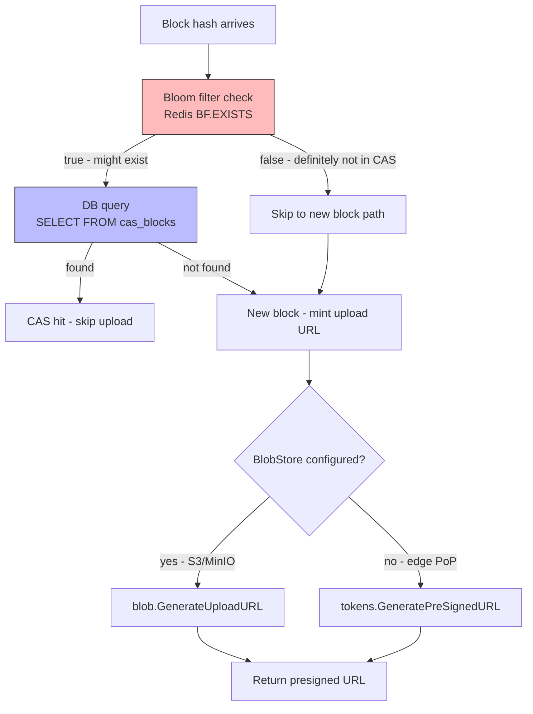

### How to read this diagram

This traces the **CAS deduplication check** that happens during the Initiate phase. The bloom filter is the fast path; the database is the slow path.

### Important observations

- **Bloom filter is fail-open:** If Redis is down, all hashes fall through to DB (no false negatives possible).
- **Two paths for URL generation:** Direct-to-S3 (BlobStore) or HMAC token (TokenSigner).
- **Bloom filter reduces DB load by ~90%:** Most repeat uploads hit the bloom filter.

### Questions I should ask myself

1. What is the false positive rate of the bloom filter (1%) and how does it affect performance?
2. How does the bloom filter TTL (1 hour) affect dedup accuracy?
3. What happens if two concurrent initiates try to ensure the same CAS block?
4. How does the system handle a bloom filter key that doesn't exist yet?
5. What is the memory footprint of the bloom filter for 1M blocks?

---

## 6. Data Flow Diagram

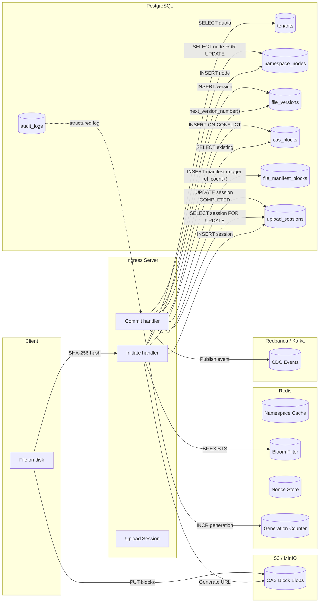

### How to read this diagram

This shows **how data flows through the system** during a complete file upload. Left-to-right: client → server → storage systems. The solid arrows are mandatory data flows; dashed arrows are optional/best-effort.

### Important observations

- **Data crosses 4 storage systems:** PostgreSQL (metadata), Redis (cache/nonces), S3 (blobs), Kafka (events).
- **PostgreSQL is the source of truth:** All metadata lives here.
- **Redis is a cache/nonces layer:** Not authoritative for any data.
- **S3 holds the actual file content:** Server never sees bytes.
- **Kafka carries derivation events:** Asynchronous, eventually consistent.

### Questions I should ask myself

1. What is the consistency model between PostgreSQL and Redis cache?
2. How does the system ensure that a block is in S3 before the commit transaction completes?
3. What happens if the Redis generation bump fails after a successful commit?
4. How does the system handle a situation where S3 has the block but PostgreSQL doesn't?
5. What is the data retention policy for each storage system?

---

## 7. Authentication Flow

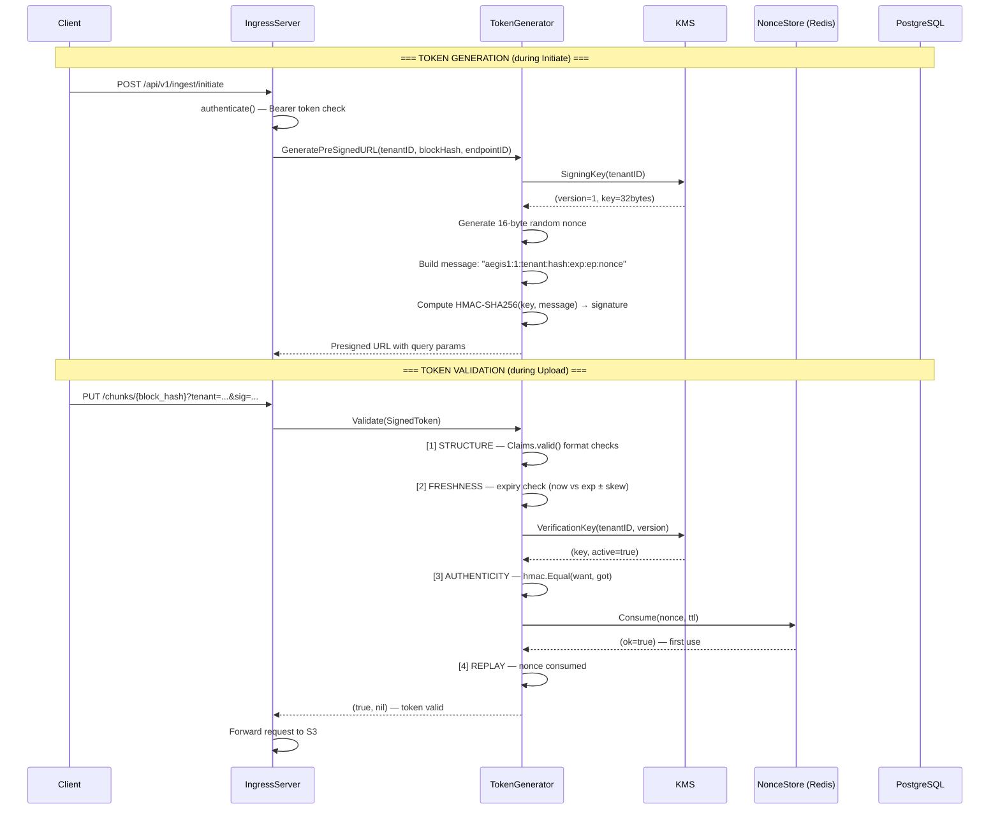

### How to read this diagram

This traces the **complete authentication lifecycle**: token generation during Initiate, and token validation during Upload. The 5 security properties are enforced in order during validation.

### Important observations

- **Token generation happens server-side:** The server mints the URL, not the client.
- **Validation order matters:** Cheap structural checks first, expensive crypto last, nonce consumption last.
- **Nonce is consumed AFTER signature check:** Prevents burning valid nonces with garbage signatures.
- **Key version is inside the signed message:** Version downgrade breaks the signature.

### Questions I should ask myself

1. Why is the nonce consumed after the signature check instead of before?
2. What happens if two concurrent requests use the same nonce?
3. How does the system handle clock skew between client and server?
4. What is the impact of the 15-minute TTL on large file uploads?
5. How does key rotation affect in-flight pre-signed URLs?

---

## 8. Database ER Diagram

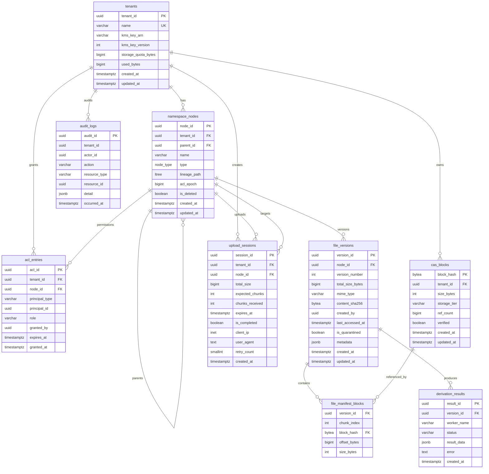

### How to read this diagram

This is an **Entity-Relationship diagram** derived from `db/schema.sql`. Lines show relationships; cardinality symbols show the nature of each relationship (one-to-many, etc.).

### Important observations

- **cas_blocks.block_hash is the primary key:** Not auto-generated; it's the SHA-256 hash of the content.
- **Cross-tenant CAS dedup:** `cas_blocks.tenant_id` is attribution only, not part of the identity.
- **file_manifest_blocks is the join table:** Links file_versions to cas_blocks (many-to-many).
- **ref_count is trigger-maintained:** The `manifest_block_added/removed` triggers update it.
- **audit_logs is range-partitioned:** Monthly partitions for performance and retention.
- **namespace_nodes.lineage_path is trigger-computed:** Never trusted from application code.

### Questions I should ask myself

1. Why is `block_hash` the primary key of `cas_blocks` instead of an auto-generated UUID?
2. How do the `manifest_block_added/removed` triggers maintain `ref_count` atomically?
3. What is the purpose of the `acl_epoch` column on `namespace_nodes`?
4. How does the `lineage_path` ltree enable efficient hierarchy queries?
5. What happens when a `file_versions` row is deleted (CASCADE vs RESTRICT)?
6. How does the `is_deleted` flag on `namespace_nodes` enable soft deletes?
7. What is the partition strategy for `audit_logs` and why is it range-partitioned?
8. How does the `upload_sessions` CHECK constraint ensure completed sessions have a node_id?

---

## 9. Sequence Diagrams

### 9.1 File Initiate

```mermaid
sequenceDiagram
    actor Client
    participant Server as IngressServer
    participant Store as PgStore
    participant DB as PostgreSQL
    participant S3 as S3/MinIO
    participant KMS as KMS

    Client->>Server: POST /api/v1/ingest/initiate<br/>{tenant_id, file_name, chunks}
    Server->>Server: authenticate() + RateLimiter.Allow()
    Server->>Server: decodeJSON + Validate()
    
    Server->>Store: GetTenantQuota(tenantID)
    Store->>DB: SELECT storage_quota_bytes, used_bytes<br/>FROM tenants WHERE tenant_id=$1
    DB-->>Store: TenantQuota{quota, used}
    Store-->>Server: TenantQuota
    Server->>Server: Check: used + requested > quota?
    
    alt NodeID provided
        Server->>Store: ValidateFileNode(tenantID, nodeID)
        Store->>DB: SELECT type FROM namespace_nodes<br/>WHERE node_id=$1 AND tenant_id=$2
        DB-->>Store: "FILE"
        Store-->>Server: nil (valid)
    else NodeID not provided
        Server->>Store: CreateFileNode(tenantID, parentID, name)
        Store->>DB: BEGIN; INSERT INTO namespace_nodes<br/>... RETURNING node_id; COMMIT
        DB-->>Store: newNodeID
        Store-->>Server: newNodeID
    end
    
    Server->>Store: BatchQueryExistingCAS(hashes)
    Store->>DB: SELECT block_hash FROM cas_blocks<br/>WHERE block_hash = ANY($1)
    DB-->>Store: existing hashes
    Store-->>Server: map[string]bool
    
    loop For each missing block
        Server->>S3: GenerateUploadURL(tenantID, hash, size)
        S3-->>Server: presigned PUT URL
    end
    
    Server->>Store: CreateUploadSession(tenantID, nodeID, totalSize, chunks)
    Store->>DB: BEGIN; INSERT INTO upload_sessions<br/>... RETURNING session_id, expires_at; COMMIT
    DB-->>Store: sessionID, expiresAt
    Store-->>Server: sessionID, expiresAt
    
    Server-->>Client: 200 {session_id, node_id, expires_at, upload_urls}
```

### 9.2 File Commit

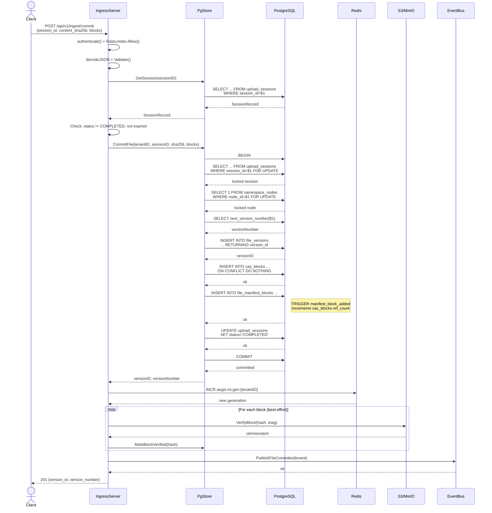

### 9.3 GC Block Sweep

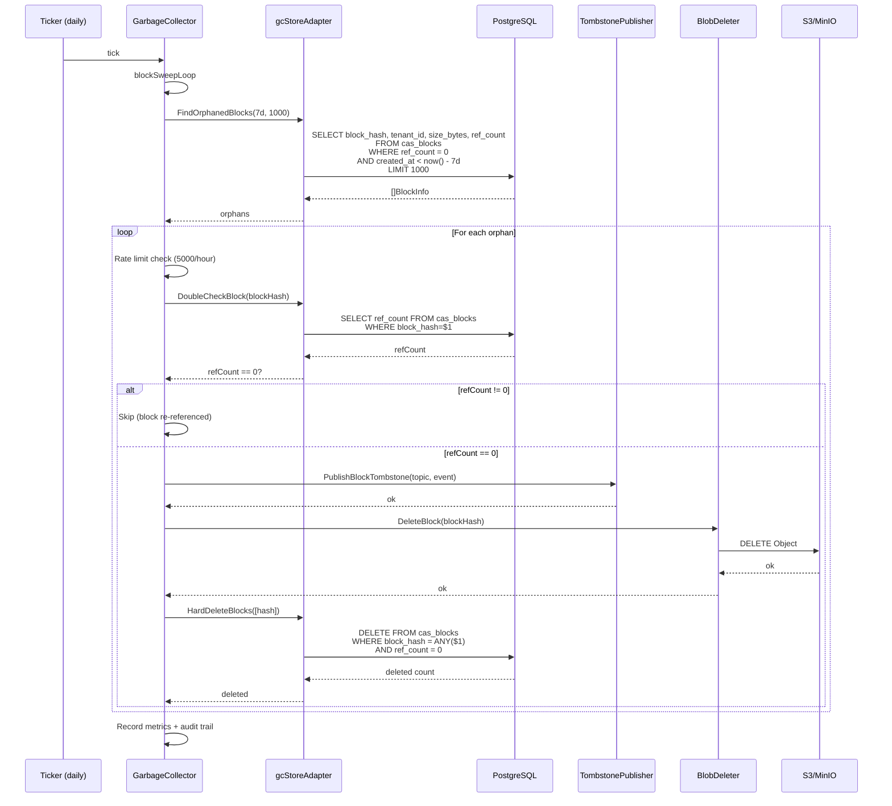

### 9.4 HMAC Token Validation

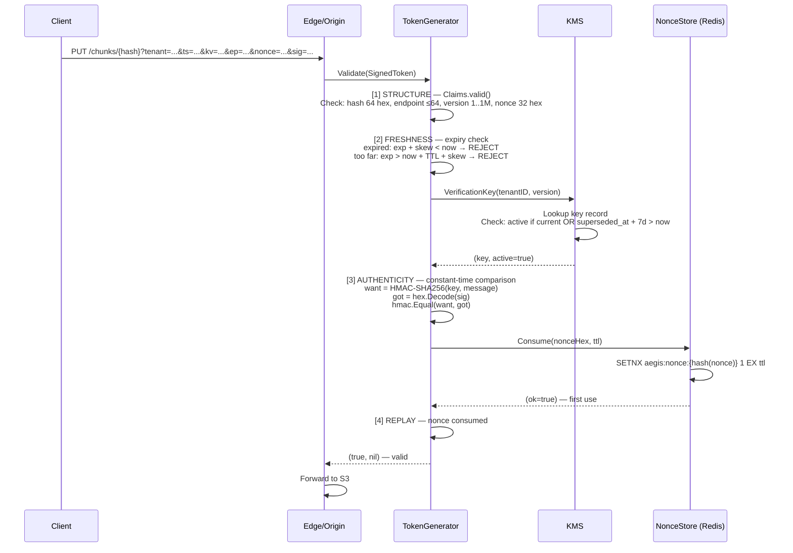

### 9.5 CAS Dedup with Bloom Filter

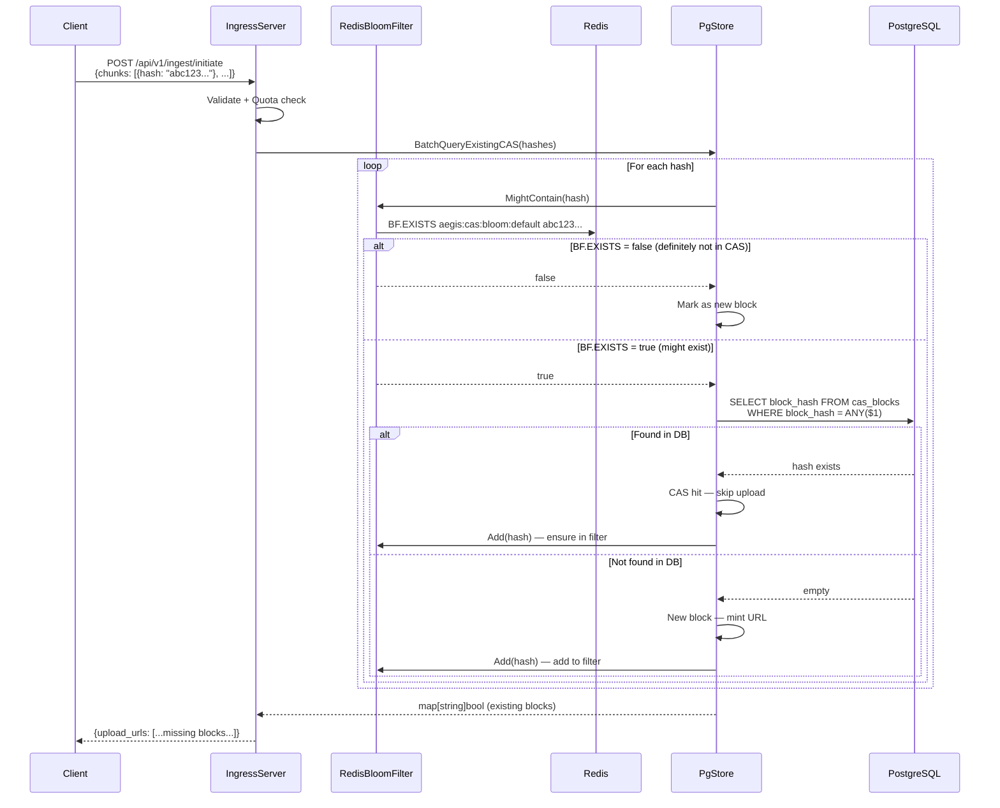

### How to read these sequence diagrams

Each diagram traces a **specific operation** from start to finish. Horizontal arrows are messages between components; vertical bars are lifelines. `alt` blocks show conditional logic; `loop` blocks show iteration.

### Important observations

- **Initiate is read-heavy:** 4 DB queries, 1 S3 call, 1 Redis call.
- **Commit is write-heavy:** 6-8 DB queries in a single transaction, plus best-effort post-commit work.
- **GC has double-check:** Extra DB query per block to prevent race conditions.
- **Auth validation is ordered:** Cheap checks first, expensive crypto last, nonce consumption last.
- **Bloom filter reduces DB load:** Most repeat uploads skip the DB query entirely.

### Questions I should ask myself

1. What is the minimum latency for an Initiate request under ideal conditions?
2. How does the FOR UPDATE lock on the session prevent double-commit?
3. What happens if the GC double-check finds ref_count > 0?
4. Why is the nonce consumed after the signature check in the auth flow?
5. How does the bloom filter handle the case where the Redis key doesn't exist yet?

---

## 10. Deployment Architecture

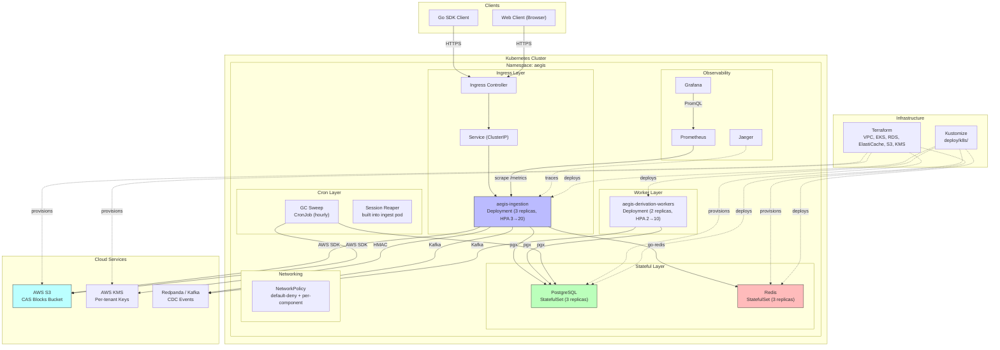

### How to read this diagram

This shows the **production deployment architecture** on Kubernetes. Top-to-bottom: clients → Kubernetes cluster → cloud services. The cluster contains the application, databases, workers, and observability stack.

### Important observations

- **Ingress is a Deployment with HPA:** Scales from 3 to 20 replicas based on load.
- **PostgreSQL and Redis are StatefulSets:** 3 replicas each for high availability.
- **Derivation workers are separate Deployments:** Scale independently from ingestion.
- **GC runs as a CronJob:** Hourly sweeps, not a long-running process.
- **Network policies enforce isolation:** Default-deny + per-component whitelists.
- **Terraform provisions cloud resources:** VPC, EKS, RDS, ElastiCache, S3, KMS.
- **Kustomize deploys application:** All manifests in `deploy/k8s/` with overlays.

### Questions I should ask myself

1. How does the HPA determine when to scale the ingestion service?
2. What is the failover behavior when a PostgreSQL replica goes down?
3. How does the session reaper handle stale sessions across multiple ingestion replicas?
4. What network policies prevent derivation workers from accessing the internet?
5. How does Terraform manage state for the cloud infrastructure?
6. What is the rollback procedure if a K8s deployment fails?
7. How does the system handle a PostgreSQL primary failover?
8. What is the storage class for the PostgreSQL PersistentVolumeClaims?
9. How does Prometheus discover ingestion pods for scraping?
10. What alerts are configured for the production system?

---

## Appendix: Diagram Source Files

All diagrams are in Mermaid syntax and can be rendered with:
- [Mermaid Live Editor](https://mermaid.live)
- VS Code with Mermaid extension
- GitHub/GitLab markdown rendering
- Any Mermaid-compatible tool

The source for each diagram is in the corresponding code block above. To update a diagram, edit the Mermaid code block and re-render.
